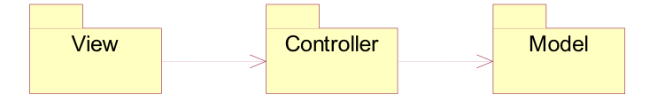

## 技术选型

### 需求概述

当前任务是为中山大学至善学生活动中心开发一个新的排班系统，从而替代原有的旧系统，为学生助理提供排班和考勤的功能。

### 主要需求

该系统有三个角色：管理员、助理以及公共用户。

管理员的功能是安排班次以及公布值班表。管理员登陆系统后，可以看到一张班次表，里面有所有助理选择的班次。管理员根据实际需求来安排合适的值班表。安排完成后管理员可以选择公布值班表，这样每一位助理就能通过登陆系统看到自己所在的班次。

助理的功能是注册、选择班次以及查看班次。助理使用该系统前需要先进行注册。助理注册时需填写自己的用户名和密码，填写完毕后，系统会检测用户名是否已存在以及密码长度是否符合要求。助理注册成功后方可登陆系统，此时助理可以自由选择合适的班次并提交。待管理员公布最终的值班表时，助理可以登陆该系统来查看自己的班次。另外助理还可以在系统中查看到自己已有的工时。

公共用户的功能是考勤。助理上班时用公共用户登录，此时可以看见一张值班表，找到当日当次班次自己的名字并选择签到，系统就会记录该助理已到并增加他的工时。若助理是代班人员，那么可以选择代班，并在弹出的表单中填写自己的名字，这样系统就会记录该班次的代班情况，并增加代班人员的工时。

### 主要技术

MVC架构 + Python + bootstrap + MySQL

### 主要运行平台

基于Ubuntu服务器

### 选型理由

#### MVC架构

本系统采用MVC架构模式，MVC分为Model View Controller三层，是模型(model)－视图(view)－控制器(controller)的缩写，一种软件设计典范，用一种业务逻辑、数据、界面显示分离的方法组织代码，将业务逻辑聚集到一个部件里面，在改进和个性化定制界面及用户交互的同时，不需要重新编写业务逻辑。MVC被独特的发展起来用于映射传统的输入、处理和输出功能在一个逻辑的图形化用户界面的结构中。因为其耦合性低，重用性高，有利于软件工程化管理的特点，被我们用来作为本系统的系统架构。

#### Python

Python是一种面向对象、解释型计算机程序设计语言，它语法简洁而清晰，具有丰富和强大的类库。而且，使用Python可以快速生成页面，在本系统中，我们直接用Python生成了最终的页面，十分方便高效。而且语句也比较简明，方便队员之间的协同和代码互相理解。

#### bootstrap

Bootstrap基于 HTML、CSS、JAVASCRIPT ，它简洁灵活，使得 Web 开发更加快捷。是目前十分主流的前端框架。由于我们小组比较缺乏前端的开发经验，所以经过讨论之后决定使用现在比较主流的框架来进行搭建，一来节约开发的成本和时间，二来也通过这个稍微了解一些前端的技术。bootstrap作为现在比较受欢迎的框架，它里面确实提供了很多的接口可以直接调用，给开发提供了不小的便利。

#### MySQL

MySQL是一种关联数据库管理系统，关联数据库将数据保存在不同的表中，而不是将所有数据放在一个大仓库内，这样就增加了速度并提高了灵活性。MySQL 所使用的 SQL 语言是用于访问数据库的最常用标准化语言。由于其体积小、速度快、总体拥有成本低，尤其是开放源码这一特点，所以被我们用来作为本系统的数据库管理系统。

## 架构设计

### 概述

本系统采用MVC架构模式，MVC全名是Model View Controller，是模型(model)－视图(view)－控制器(controller)的缩写，一种软件设计典范，用一种业务逻辑、数据、界面显示分离的方法组织代码，将业务逻辑聚集到一个部件里面，在改进和个性化定制界面及用户交互的同时，不需要重新编写业务逻辑。MVC被独特的发展起来用于映射传统的输入、处理和输出功能在一个逻辑的图形化用户界面的结构中。

### 使用MVC框架的原因

#### 耦合性低

视图层和业务层分离，这样就允许更改视图层代码而不用重新编译模型和控制器代码，同样，一个应用的业务流程或者业务规则的改变只需要改动MVC的模型层即可。模型返回的数据没有进行格式化，所以同样的构件能被不同的界面使用。因为模型与控制器和视图相分离，所以很容易改变应用程序的数据层和业务规则。

#### 重用性高

MVC模式允许使用各种不同样式的视图来访问同一个服务器端的代码，因为多个视图能共享一个模型。由于已经将数据和业务规则从表示层分开，所以可以最大化的重用代码。

#### 有利软件工程化管理

由于不同的层各司其职，每一层不同的应用具有某些相同的特征，有利于通过工程化、工具化管理程序代码。控制器也提供了一个好处，就是可以使用控制器来联接不同的模型和视图去完成用户的需求，这样控制器可以为构造应用程序提供强有力的手段。给定一些可重用的模型和视图，控制器可以根据用户的需求选择模型进行处理，然后选择视图将处理结果显示给用户。

### Model层

模型层管理系统的数据，并为控制层提供数据访问的接口。本系统设置了4个Model分别是FinalScheduleTable，FinalUserTable，ScheduleTable和UserTable。分别控制最终的排班表，最终的用户表，临时排班表，临时用户表这四个SQL表在数据层面上的读写及一些其他操作。

### View层

视图层负责用户和系统间的交互，它将用户的请求信息传递给控制层，并把返回的结果呈现给用户。本系统中采用了AttendInterface，DutyInfoInterface，RegisterInterface和SelectInterface，渲染出四个不同的界面，用于提供用户的交互。

###	Controller层

控制层控制应用程序的流程，它对用户行为以及数据的修改做出处理以及响应。本系统在Controller设置了AttendManager，DutyInfoManager，ResisterManager和SelectManager分别对四个界面传输过来的用户操作进行处理和响应。

## 模块划分

### 注册

#### 概述

首次使用本系统时，需要注册之后才能登录。注册时需要输入学号，姓名，密码。如果正确输入了以上信息则注册成功，点击注册成功界面的登录按钮返回登录界面。

### 登录

####概述

用户打开本系统时，首先打开登录界面。直接输入已经注册过的账号和正确的密码则可以登录成功。若输入的用户名在数据库中没有记录，及未注册，则跳转到“未找到用户”的界面提示。若密码错误，则显示“密码错误”的提醒。如果未注册过，可以直接点击注册，进入注册页面。

### 选择班次

#### 主要功能

用户进入选择班次界面后，系统返回用户已选的班次表。

用户根据系统返回的班次表进行添加和删除班次操作。

业务逻辑层收到命令后开始执行相应的操作，并通过实体层将操作的结果保存起来。

#### 设计与实现

边界类：用例中，边界类为选择班次界面（SelectInterface），向用户提供可选班次的列表。

控制类：控制类为选择班次（SelectManager），控制类对用户执行的添加和删除操作进行处理。

实体类：实体类为班次表（ScheduleTable），记录该助理已选择的班次。

### 查看班次

#### 概述

通过public账号登录界面之后就进入查看班次的界面。以表格的形式显示当前的排班情况。

### 安排班次

#### 主要功能

管理员在安排班次界面中选取合适的班次，并在该班次旁边点击“选择”；当管理员需要撤销该选择时，可以点击“撤销”。

安排班次的业务逻辑层接收到“选择”或“撤销”的命令后开始执行相应的操作，并通过实体层将操作的结果保存起来。

#### 设计与实现

边界类：安排班次界面（ArrangeInterface），该界面显示了所有助理的班次信息。

控制类：安排班次（ArrangeManager），该类接收到“选择”和“撤销”的命令后执行相应的操作。

实体类：班次表（ScheduleTable），该类储存了所有助理的班次信息，包括班次号，助理姓名，是否保留等。

### 公布排班表

#### 概述

在使用管理员账号登录排班完成之后，点击启用，则更新为最终使用的排班表，公布在了服务器上。可以通过登录public账号来查看。

### 考勤

#### 主要功能

用户进入考勤界面后，系统返回值班表。

用户在自己的班次处选择考勤或撤销。

业务逻辑层收到命令后开始执行相应的操作，并通过实体层将操作的结果保存起来。

#### 设计与实现

边界类：边界类为考勤界面（AttendInterface），为助理提供签到以及撤销的功能。

控制类：控制类为考勤（AttendManager），控制类对助理选择的操作进行处理。

实体类：实体类为用户（User）以及班次表（Schedule），记录用户的值班次数以及班次的考勤情况。

### 查看工时

#### 概述

通过public账号登录界面之后就进入查看班次的界面。以表格的形式显示当前的排班情况。点击右上角的工时表可以查看工时。这里以姓名为key建表，可以在这里看到不同同学的工时情况。

##软件设计技术

### Structure Programming

结构化程式设计是以一些简单、有层次的程式流程架构所组成，可分为顺序、选择及循环。结构化程序设计提出的原则可以归纳为32个字：自顶向下，逐步细化；清晰第一，效率第二；书写规范，缩进格式；基本结构，组合而成。

我们的项目采用结构化的编程语言以及结构化的编程思想来实现。这主要体现在:

- Python本身且我们使用的框架webpy都不支持goto语句，这使得我们编写的python程序本身就只能由顺序、选择及循环这些基本结构组成。

- 我们将全部操作逻辑都定义成了函数，在函数里完成对其他函数的调用。这样就可以不断重用代码，使得代码具有很强的可复用性。

举个例子，在用例登录和注册中，我们都需要对数据库做查询以判断该用户是否存在数据库中，所以我们对数据库查询用户这一操作封装成了函数:
<p align=left>代码清单1: Model/UserTable.py中的```select```函数</p>

```python
db = settings.db
tb = 'user_data'

def select(my_id, my_name, my_type):
    if my_type == 'id':
        users = db.select(tb, where='s_id=$my_id', vars=locals())
        return users;

    elif my_type == 'name':
        users = db.select(tb, where='s_name="'+my_name+'"')
        return users

    elif my_type == 'all':
        users = db.select(tb)
        return users

    elif my_type == 'order':
        users = db.select(tb, order='s_id asc')
        return users
```

### Object-Oriented Programming

面向对象程序设计是一种程序设计范型，同时也是一种程序开发的方法。类的实例即为对象，它将对象作为程序的基本单元，将程序和数据封装其中，以提高软件的重用性、灵活性和扩展性。面向对象的分析根据抽象关键的问题域来分解系统。

我们的项目采用面向对象的编程语言和编程思想来实现。这主要体现在：

- 在Python中一切都是对象，包括函数、模块等，并且几乎一切都有属性和方法。万物皆对象意味着一切都可以赋值给变量或作为参数传递给函数。

- 通过对用例的分析，我们可以将一些逻辑上紧密相连的操作组合在一起，析取出类的设计。

举个例子，我们将对数据库中班次表的增删改查（CRUD）操作封装到一个类ScheduleTable中。这样我们的Control层需要对班次表进行操作时，则可以实现复用。代码如下:
<p align=left>代码清单2: Model/ScheduleTable.py</p>

```python
#!/usr/bin/env python
# coding: utf-8
import web
from Config import settings
from Config.url import urls

render = settings.render
db = settings.db
tb = 'schedule'

def select(sid, sname, stype):
    if stype == 'id':
        schedules = db.select(tb, where='id="'+sid+'"')
        return schedules;
        
    elif stype == 'name':
        schedules = db.select(tb, where='s_name="'+sname+'"')
        return schedules

    elif stype == 'all':
        schedules = db.select(tb)
        return schedules

    elif stype == 'norder':
        schedules = db.select(tb, where='s_name="'+sname+'"', order='s_time asc')
        return schedules

    elif stype == 'order':
        schedules = db.select(tb, order='s_time asc')
        return schedules

def update(sid , skeep):
    db.update(tb, where='id="'+sid+'"', keep=skeep)

def delete(sid, sname, stype):
    if stype == 'id':
        db.delete(tb, where='id=$sid', vars=locals())
    elif stype == 'name':
        db.delete(tb, where='s_name=$sname', vars=locals())    
```

###Design Patterm
####中介者模式
---
中介者模式用一个中介的物件来封装物件彼此之间的交互，物件之间并不用互相知道另一方，这可以降低物件之间的耦合性，如果要改变物件之间的交互行为，也只需要对中介者加以修改即可。

我们的项目在设计和实现时使用了中介者模式，这主要体现在由于项目采用MVC的架构，Control这一层负责着Model和View的调节和交互。

举个例子:

- 当我们的用户通过UI点击“Launch”来发布班次的时候，ArrangeInterface捕捉到这个GET请求。

- ArrangeInterface调用ArrangeManager的launch()方法。

- ArrangeManager在launch()方法里通过调用ScheduleTable和FinalSchedule的方法来对数据库进行操作。

这样子就实现了View和Model之间并不知道彼此的存在，只是通过Control这一中介进行交互，即中介者模式，如下图：



####命令模式
---
命令模式把一个请求或者操作封装到一个对象中。当一个对象捕捉到事件发生时，它通过调用Commond对象的指定方法，而不需要知道Commond对象的具体内容。

我们的项目中使用了WebPy，它是通过命令模式来完成对HTTP请求的分发响应的：

- 当WebPy捕捉到HTTP请求事件时，它通过url.py里的url数组，获得对应的Commond对象。

- 如果接收到的是GET请求，则调用Commond对象的Get方法，其他请求类型同理。

这样子我们在编程的时候，就可以实现事件捕捉和事件处理的脱耦合。举个例子，我们在url数组里指明发送到"/schedule/logout"的请求，都交由View.LogoutInterface.Logout这个Commond对象处理。而在View.LogoutInterface.Logout里定义了Get方法来实现用户登出的逻辑操作。

具体代码如下:

通过url数组绑定请求地址和Commond对象。

代码清单3: Config/url.py

```python
#!/usr/bin/env python
# coding: utf-8

logout = 'View.LogoutInterface.'
register = 'View.RegisterInterface.'
...

urls = (
    '/schedule/register', register + 'Register',

    '/schedule/logout', logout + 'Logout',
    ....
)
```

在Interface里定义Commond对象的处理方法。

代码清单4: View/LogoutInterface.py

```python
#!/usr/bin/env python
# coding: utf-8
import web
from Controller import LogoutManager
from Config import settings
from Config.url import urls

class Logout:

    def GET(self):
        LogoutManager.logout()
        raise web.seeother('/')
```


